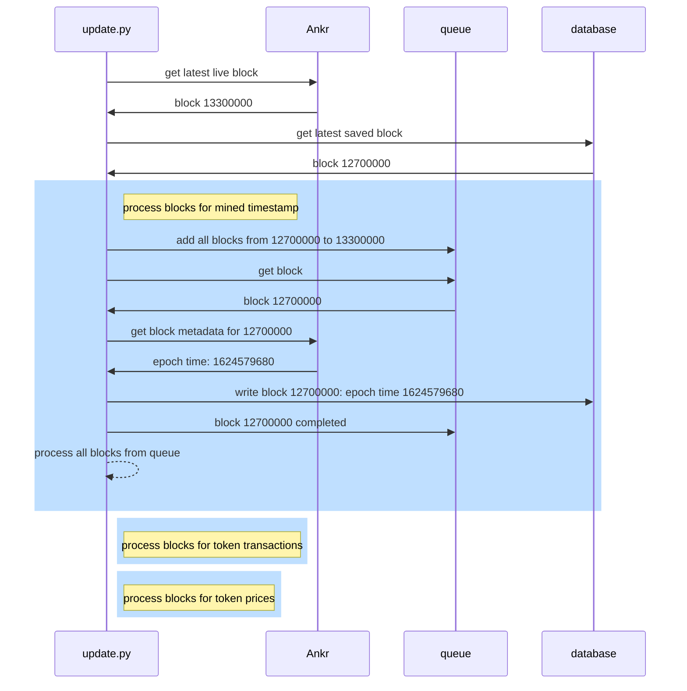

# Stonks

We do these things not because they are easy, but because we thought they were going to be easy. - The Programmers' Credo

This is an attempt at using AI to help speculate on crypto.

Need to rename: Make it make cents, Coin-cidence? ok ya maybe, Cryp-go-up, 

## Data Aggregation

* **Ankr**: web3 API that contains vanilla ethereum blockchain data like block times, transaction logs, etc
* **Transpose.io**: API that provides date-indexed price data for various cryptocurrencies
* **processing queue**: persistentqueue that allows for fault-tolerant processing of data
* **local database**: SQLite3 database that contains processed blockchain data

### Syncing Blockchain Data

* fault-tolerant processing queue:
  * network errors will lead to the processing of a block failing
  * this block will then get picked up and retried by the next worker
  * the update.py process can be shut down and restart safely with no data loss
* local database:
  * ~1ms write times, sub-1ms read times
  * much faster read/write times than an online database and it's free
  * allows for data processing completely offline or with poor internet quality

## Results

The following is a TD3 (Twin Delayed Deep Deterministic Policy Gradient) algorithm 
applied to processed blockchain data for a scammy token called Pepefork.

### Training

* 20x increase in underlying training data
* 148x increase in the model's starting funds
* The model performed 640% better than the market

640% better than the market is a great initial result, but this does not predict real 
life performance because the model trained and learned on this data and could potentially 
just be memorizing the underlying data.

### Validation

* 53% increase in underlying validation data
* 244% increase in the model's starting funds
* The model performed 360% better than the market

360% better than the market is another great indication, but this is also tainted because
the model is constantly checking its performance against the validation data, so this could
just be a lucky guess.

### Test

* 48% decrease in underlying test data
* 2% increase in the model's starting funds
* The model did not earn money but also did not lose money while the market tanked

This result is the most interesting because it's on completely unseen data and the market tanked
48% on this last data set while the other two data sets had price increases. Even with the different
market conditions, the model was able to significantly outperform the market.

## All that glitters is not gold

* This algorithm was able to learn how to trade Pepefork, but was not able to learn from any the
other few tokens that I tested.
* Many trades are made, but all have a fairly low success rate. Similar to a casino where a higher number
of trades makes up for a barely above 50% success rate.
  * Ideally, the model would make 5 trades a day instead of 500 and those 5 would have
  very high confidence of a positive return.
* Too many trades to manually trade and keep track of and I don't have enough confidence to allow the model
to do automated trades. 

## What next?

### Transformers

* it's the current hotness
* transformers are supposed to be good a learning patterns
  * particularly attending to relevant signals in a large pile of data
* Programmers' Credo (see top)

### More signals

* Currently, the main unique signal is tracking buy/sell behavior of different percentiles of
token holders.
  * When do the top 0.1% of token holders buy and sell? What about the top 10%? What if the top
  1% is selling and the top 50% is buying?
  * This data is one of the signals, in addition to overall price and volume, the model is training on. 
* Top percentiles of earners is also interesting. 
  * Profits can be calculated based on the price of the token when a wallet acquired the token 
  and the price when they sold the token.
  * Unfortunately, my preliminary poking around has not found this to be a useful signal for learning.
* There should be many more signals that I have yet to try or find.
  * ML-based categories of wallets based on trading activity, holdings, profits, etc.
  * Percentiles based on total value of wallet, total volume of wallet, 

### Ensemble-based confidence intervals

I'm gonna need something bigger than a macbook for this:
* hundreds of agents all trained individually with slightly different parameters
  * varying trading cost
    * does increased trading cost result in a higher percentage of successful trades?
  * limited trading frequency
    * if you can only buy once every 4 hours, does that result in higher percentage?
  * forced holding time
    * what happens if you can buy, but have to hodl for at least 12 hours?
* feed all the actions of the various agents as input into an orchestrator that trades based on those actions
  * if 80% of the varied trading cost agents and 40% of the limited trading frequency agents
  all think it's time to buy, maybe that's a high confidence time to buy?
  * ML on the ML: train a neural net to act on all the actions from the various agents
